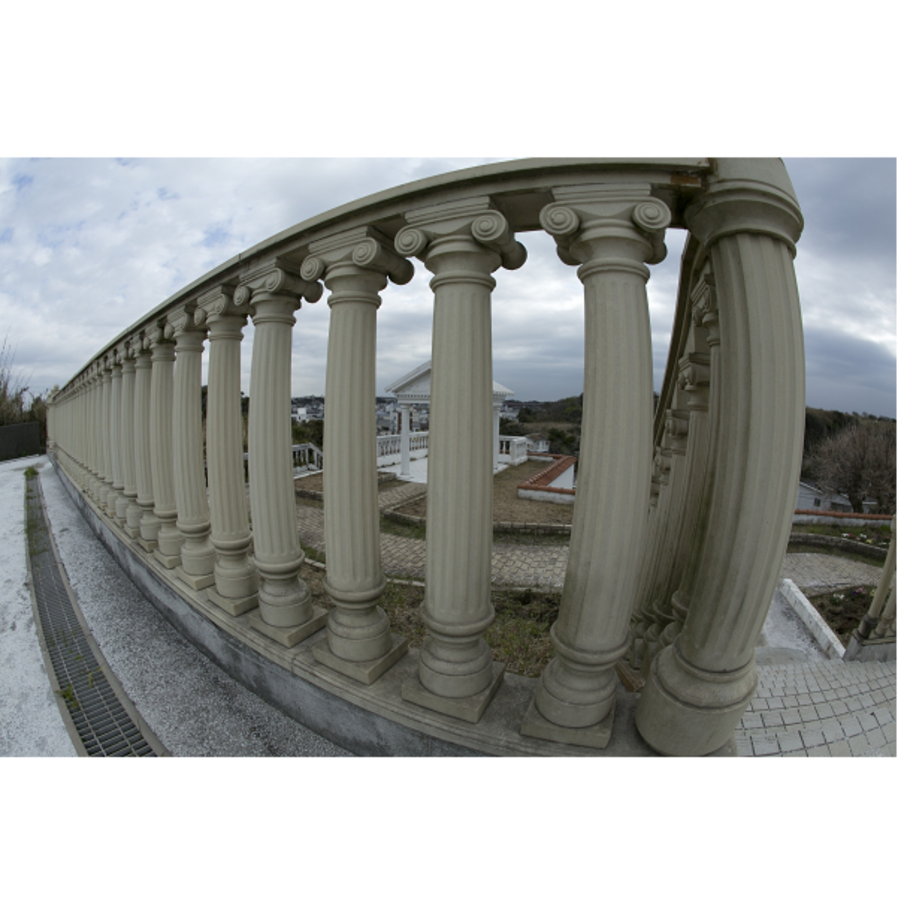
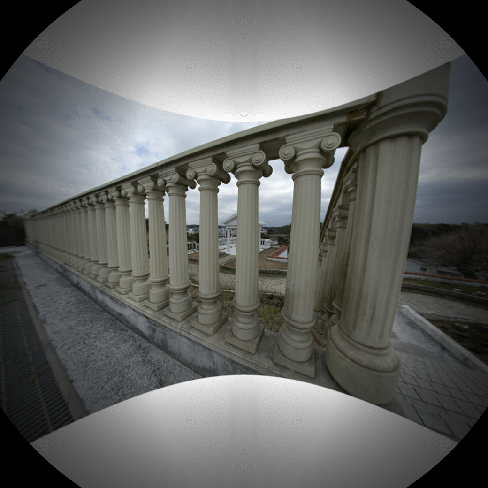
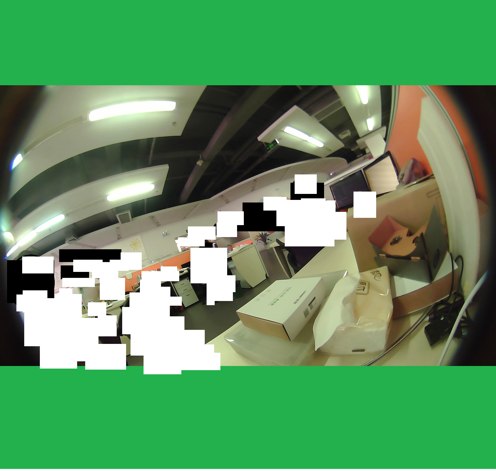
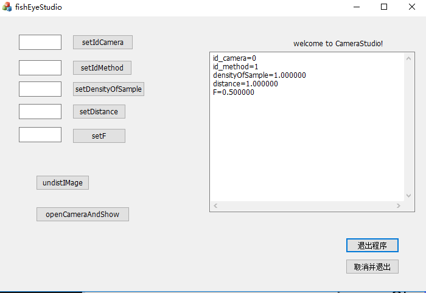
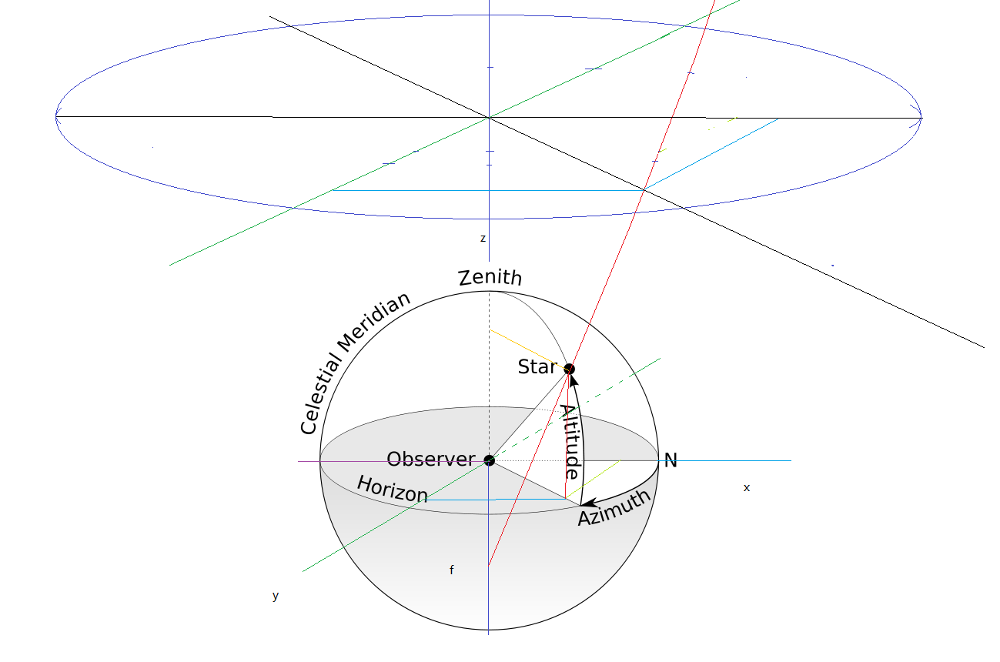
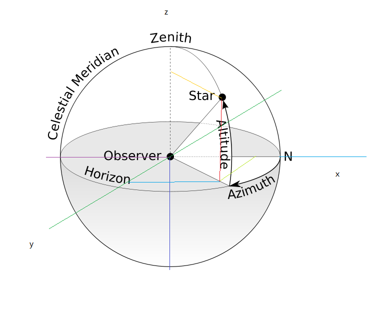
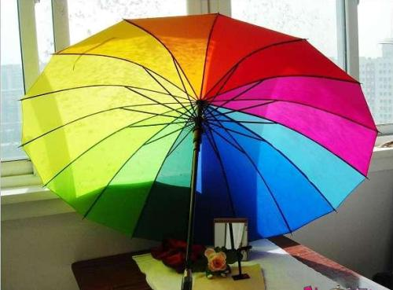
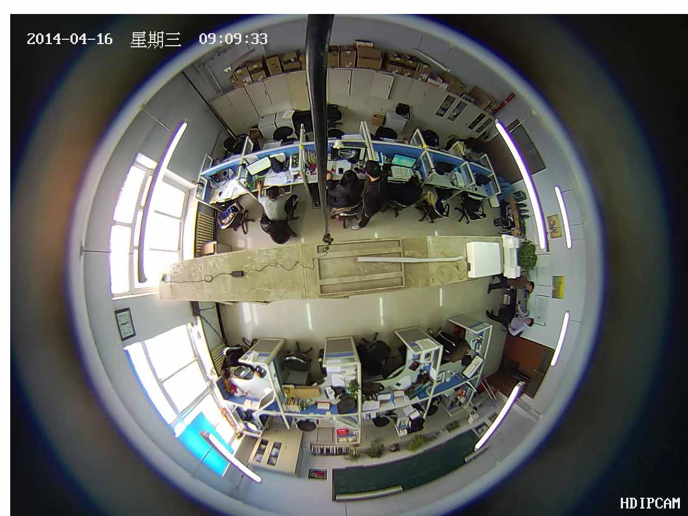

fisheye

提供了三种方法进行鱼眼镜头校正：多项式法（有待完善），等距投影法，opencv的标定板的方法。
- 都有待进一步的提高效果。
- 目前效果最好的是opencv的结果。
- 自适应性最好的是等XY投方法，但是有一些精度上的问题，在建模的时候暂时只对整体进行了建模，没有考虑水平和垂直方向的差异；没有考虑光心与主点的偏移的问题，没有将内外参数进行分解，这些都是在后面的工作中需要i那一步的改善的地方。
另外也应当考虑更加合理的模型，更加好用的模型。
 - 第一：
 - 下面两个是等XY投的结果：
输入图像：

输出图像

输入图像：

输出图像

第二：opencv的结果

第三：其它细节或者过程中的搞笑图片

